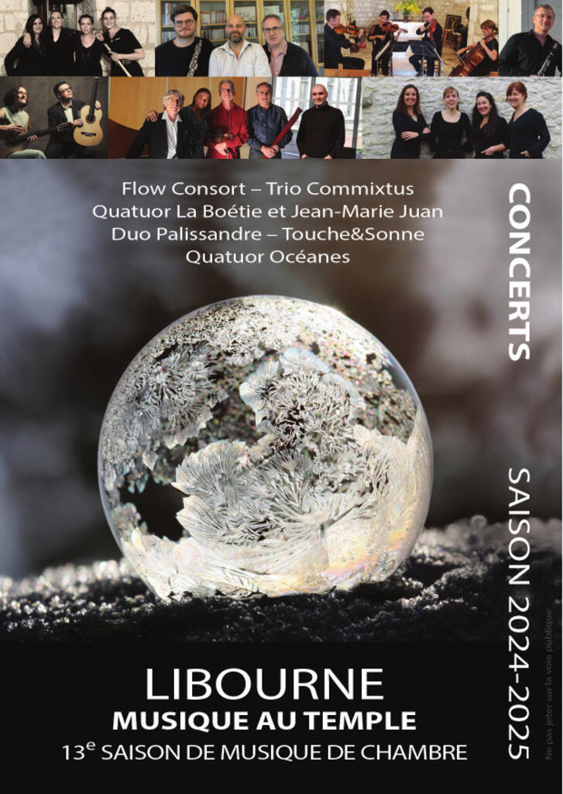

### 13ème saison de musique de chambre au temple de Libourne (33500)

### Orfeo 2000 une série de concerts dans le libournais. L’ensemble Orfeo 2000 (2 flûtes et clavecin) revient dans les vignobles du Bordelais comme il le fait depuis plus de 20 ans. Au programme des musiques des 17ème et 18ème siècles. Temple de Libourne le mardi 20 août, église de St-Christophe-des-Bardes le mercredi 21 août et le jeudi 22 août au temple de Castillon-la-Bataille. Concerts à 19h.

### FAITES DE LA MUSIQUE, c'est bien le 21 juin au temple de Libourne (place du doyen Carbonnier, 33500) de 20h30 à 22h.

 Au milieu des choristes de la chorale de l'Université du Temps Libre et de l'Ensemble Choral de Libourne venez chanter quelques chansons. On apprend la mélodie puis vous chantez soutenus par la polyphonie des chanteurs. 
Impression magique garantie !

### L'Ensemble Choral de Libourne donne un concert de musiques variées, du baroque à la musique latino, à Saint-Christophe-des-Bardes le 7 juin 2024, 20h30.

### Ou à Arès (33) le 8 juin.

### 14ème Stage de Chant Choral, Technique Vocale et Méthode Fesdenkrais à Saint Germain de la Rivière (33), du 6 au 9 juillet 2024, organisé par l'Ensemble Choral de Libourne.

Nous serons en compagnie (bienveillante) de Nadine Gabard, Laurent Cerciat et Jean Arzel.

### Concert Marc-Antoine CHARPENTIER de l'Ensemble Choral de Libourne le vendredi 12 avril 2024

### 12ème saison de concerts de musique de chambre au temple de Libourne

### L'Ensemble Choral de Libourne et l'Harmonie de Libourne donnent un concert  de Noël à la Caserne de Libourne (mess) le vendredi 15 décembre 2023, 20h30 

### Orfeo 2000 une série de concerts dans le libournais. L’ensemble Orfeo 2000 revient dans les vignobles du Bordelais comme il le fait depuis plus de 20 ans. Le programme associera musiques des 17ème et 18ème siècles et la lecture du conte de Perrault le Petit Poucet.

### L'Ensemble Choral de Libourne chante à Castillon La Bataille, en compagnie de Chantamicale.

### Stage de Chant Choral, Technique Vocale et Méthode Fesdenkrais à Saint Germain de la Rivière (33), du 8 au 11 juillet 2023, organisé par l'Ensemble Choral de Libourne.

 